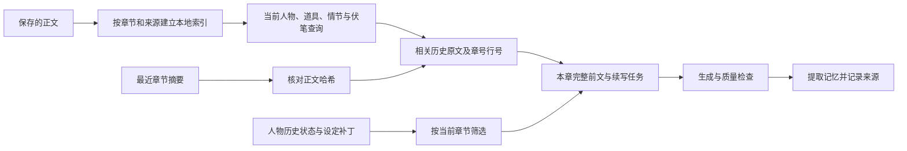

# 续写质量与长篇记忆

## 本次已完成

### 追加修复：改稿、并发同步与候选记忆

- 人物字段以 `追踪/.automatic-state-ledger.json` 记录自动写入的基线和逐章变化。旧章重写后重新同步、或撤销同步时，重放受影响字段并重建后续继承快照，避免已删除的道具、立场等继续留在后章。作者手改值与自动值不一致时保留手改内容；缺乏证据的旧基线按未知处理。
- 人工编辑过且受前章变化影响的历史块保留原文，标记失效并暂停用于自动续写。性格、角色定位、身份也按章恢复；同章重写和旧章补写不直接采用无日期的最新动态人物卡。
- 时间线、进度行和剧情摘要增加程序归属与校验值。明确的完整空提取可以清理同章自动记录；自动摘要支持更新、更名和重建。人工内容及被修改的自动内容保留，不靠文件名推断可删除性。
- 同章新同步、编辑、撤销、切章会使旧任务失效。提交按项目排队，写入前复核正文版本；提交途中发现失效时撤销本次自动结果。新的正文生成会等待这段提交或回滚结束，再读取上下文。
- 记忆先成为候选，再核对原文依据及已启用的审稿结果。剧情点、人物状态、伏笔回收和设定补丁须引用可定位的连续原文；含否定、传闻、计划等不确定表述的候选暂不自动生效。核对引用是来源检查，不是对其语义正确性的绝对证明。
- 普通续写的自动深审由写后同步统一执行，批量流程也把提交移到审稿之后。界面显示“记忆待核对，尚未生效”，不会把它当作网络故障反复重试。候选保存在项目 `.cache/memory-candidates/chapter-N.json`；流程面板展示提取内容和核对问题，作者可核对后应用或修文重同步。
- 坏 JSON、漏掉必要数组、提取失败不会当作“本章无变化”清空旧记忆。记忆提取保留完整正文，超过 40000 字符明确失败，不截掉中段再更新历史。
- 明确的别名、化名和曾用名可双向召回，歧义别名不合并；补写旧章排除未来及无日期别名。深审成功结果可在内存缓存 5 分钟、最多 16 条，正文、上下文、规则或模型配置变化会失效；失败及取消不缓存。无法可靠确定外部模型配置的 CLI 通道跳过缓存。

手动改稿保存后，应重新同步该章，才能基于新正文重建派生记忆；待核对候选不会替代已确认状态。旧项目缺乏来源和基线的内容不能被自动补造为可靠历史。

### 续写规则与输出

- 默认“自然准确的叙述”规则加入作者认可的文风示例，要求动作准确、空间与因果清楚；示例仅作语感参照，不作为剧情事实或固定句式。普通动作不随手添加“半寸、一息”等刻度，只有距离、幅度、时间影响判断或结果时才量化；“压”保留实际按压、挤压等用途，不用模糊动词笼统制造气氛。这些要求不加入机械禁词表。
- 叙述严格一段一句，句号、问号或叹号结束叙述句后换段，文风参照也按两句两段展示；不把句号机械改成逗号来规避分段，不拆断引号内尚未说完的台词。句长自然变化，取消极短段比例配额，不强制把连续动作并成长句。心理、对白、环境细节按需要保留，题材语气词按情境选用。输出前检查分段、动词、重复量化与冗余解释，不输出检查报告。
- 上述规则共用现有章节生成入口，可在“设置 → 续写规则”的“自然准确的叙述”“句段节奏”“对话规则”中编辑。已有自定义小节及空串停用继续优先；覆盖过对应小节的用户需恢复该节默认才能采用更新，不改写已保存的自定义规则。
- 字数是篇幅参考，剧情已经充分完成时可以结束；禁止通过同义复述、反复表态、机械扩写和无效铺陈补足数字。细纲给出上限时不再反过来要求至少写到上限。
- 续写先接完未完成句子、台词和进行中的剧情点，不再统一要求动作起手。收尾模式只是篇幅参考，不能据此跳过关键剧情。
- 单章续写和“一键写 10 章”共用“动作有必要才写”的默认要求：对话已经表达清楚、说话人可以辨认时允许连续对白；放碗、抬头、看一眼等随手动作若没有叙事用途就省略，不按固定间隔添加或删除。动作位置规则只约束确实需要保留的动作，必要行动、人物反应、空间与因果交代仍须写清；可在“对话规则”“描写节制与情节推进”中编辑，已有自定义覆盖按原设置生效。
- 同章已写正文完整送入上下文，避免只保留头尾、遗忘中段。超过 40000 字符时明确要求分章，不悄悄删除上下文。
- 拦截明显的流程说明、Markdown 标题/围栏、大块格式泄漏、占位内容和高置信大段复制。跨章复用也与本书历史正文检索结果对照；短台词、必要呼应不按大段复制处理。
- 编辑器、手机端和批量生成统一返回纯正文，伏笔回执不会写入批量正文；格式化保留英文词间空格。
- 只剥离字段有效的末尾伏笔回执，正文里提到相同标签不会截断后文。流式回执不再直接修改伏笔库，统一由写后正文记忆流程处理。

### 质量检查

- 单章续写每轮生成并润色后，先用整章正文对照原细纲检查伏笔，需要时自动补写并复核，再将最终稿交给记忆同步。补写能插入已有正文中段，编辑器采用整章结果，避免再次拼接前文；检查或补写失败保留本轮生成稿，暂停自动记忆同步，点“补跑同步”仍先重试伏笔检查与补写。分轮续写仅核对已经推进的场景，不把尚未写到的后续伏笔与回收当作遗漏。补写使用正文模型路由，对照使用辅助模型路由，沿用自动记忆同步的开关。
- “一键写 10 章”的连续模式发现细纲中伏笔漏写时，先按原细纲自动补写，再对照原细纲复核，最多两轮。补写只在相关场景插入正文，保留已有段落和原章末落点；不会通过删除细纲伏笔来消除遗漏。核验通过后保存新版本，并重新提取记忆、运行已启用的深审及生成概要，再进入下一章。补写失败、停止或正文版本变化时保留已保存稿并暂停；继续时复用正文补跑。预计回收日期本身不作为强制揭底任务，仍遵守本章埋设、强化及揭示范围。模型对照仍可能漏判，流程完成不代表语义绝对无误。
- 去 AI 味默认规则采用直白表达，按叙事用途删减动作、环境、心理和修饰：过多无必要描述也属于 AI 味，能删就删，不换成另一个小动作或更长的描述。对白已表达清楚时直接接续，必要的想法与情绪可以直说，不要求心理一律外化；关键行动、因果、伏笔和人物特点仍保留。这些原则用于自动润色、手动去 AI 味、二次清理及逐条改写的降级提示，已有自定义分节仍按原设置生效。此次更新不新增普通动作禁词，也不新增对无用描写的上下文语义扫描；无扫描命中时仍会跳过模型改写。
- 单换行与空行采用相同的段落口径，避免整章误判成一个长段，也避免开头的事件掩盖空洞章末。
- 重复检查覆盖跨段长片段与高度相似叙述段，保留短对白与短排比的例外。
- 关键词出现只说明发现相关文字，不证明剧情完成。否定、计划、未完成表述不再当成已落实；人物位置按人物归属核对。
- 深度审稿覆盖全文。逻辑检查在 40000 字符内一次核对全章，能同时看到相距较远的矛盾；其他维度分块并保留重叠，章末检查只看真实尾部。更长正文明确标注跨块一致性未完整核验。
- 深审调用失败、解析失败、取消均返回“未完成”诊断，不再用空结果冒充未发现问题。
- 普通续写也执行设置中的“自动深度审稿”开关。默认关闭及用户已有选择保留；未运行深审不能视为已验证剧情逻辑。语义空转、动机与跨章矛盾属于深审范围。

## 长篇记忆现在如何工作

| 层次 | 内容 | 使用规则 |
| --- | --- | --- |
| 正文证据 | 原文、章号、文件路径、行号、字符偏移、SHA-256 | 事实核对的来源；保留否定、传闻、人物视角和事件先后 |
| 近期记忆 | 本章之前最近 12 章 | 仅使用哈希匹配的摘要；否则退回明确标注的正文摘录，绝不用细纲补“既成事实” |
| 相关旧事 | 更早章节中与当前任务有关的原文 | 人物、道具、伏笔和词语加权检索，写作默认最多 8 段、4800 字符，去重并保留出处 |
| 历史状态 | 按章记录的实力、立场、目标、道具、关系、性格、定位、身份 | 逐人选有效历史快照；重同步旧章时重算后续继承，补写旧章不使用未来状态或未定年的动态字段 |
| 设定演进 | 自动新增的规则和世界观补丁 | 新补丁保留来源章节，当前章及未来补丁不注入旧章；作者原有基线与无来源旧资料保留 |

索引保存在项目的 `.cache/prose-memory-index.json`，可从正文重建。首次建立只读取当前章之前的正文，文件读取最多 4 路并发；后续检查文件元数据，只重读变化的正文。删除、改名、改写来源后，不继续引用旧索引内容。每次查询仍按章号过滤，不因缓存中曾读过未来章就提前使用它。

写后自动记忆同步会把生成该摘要所用正文的哈希一起记录。哈希证明摘要对应哪个正文版本，不证明摘要的语义绝对正确；遇到矛盾，仍应回到引用原文核对。

人物状态按章管理历史块，保留作者手写表格和备注。同章重写同步替换本程序的同章变化，并重算后续自动快照；撤销与设定补丁处理也只操作能确认归属的自动内容。

旧项目中未记录来源、时间点的资料不能自动还原出可靠历史。系统不把这些资料补盖“已验证”标签；需要时通过真实正文重新提取。作者设定的成长上限和角色秘密，也不能自动当成当章已经解锁或角色已经知晓。

## 伏笔规划与实际状态（2026-09-08）

这轮定位到细纲技能的明确错误指令：要求每生成一章细纲就填写实际回收章并改为已回收，也会提前覆盖角色最新态和时间线。本地 `.agents/skills/细纲生成` 与 `.codex/skills/细纲生成` 的入口、核心 SOP、质量校验手册均已修正；应用内细纲提示同步修正。

- **细纲只写计划。** 未来动作、角色变化、事件放在细纲和 `追踪/细纲规划.md`，实际追踪只读。原有已回收状态及已写章节的 actualized 保留，不能批量清零；新建未写章节的 actualized 为 false。
- **分表读取。** 不同列顺序、附加编号列、否定/计划字样不再错读为回收；计划附录不混入实际记录。已回收必须有可解析且不早于埋设的实际回收章，部分回收与强化分别保留实际章节。
- **日期与状态分开。** 看板实际操作须明确选择已有正文的发生章，不拿计划日期或第一章代填。逾期按已有正文的最高章号计算；支持强化、部分回收、暂缓，计划日期和备注可清空。暂缓/遗漏是作者当前的规划标记，回改旧章仍尊重当前安排，并非发生于正文中的事件。
- **有证据再提交。** 提取包含伏笔编号、原问题和本章原文；编号与原问题不符、模糊匹配不唯一、章节不符或缺少原文依据时不回收。手动提取先预览，应用时走相同的正文版本和审稿检查；旧字符串回执不能直接改状态。
- **回收按发生章节追踪。** 自动回收保存来源、原文证据和修改前后校验值。重写时清理同章消失的自动回收；撤销核对本次实际操作的凭证，防止撤掉别章、旧任务或作者手改后的状态。
- **保护旧数据。** 迁移保留原表、规划附录和作者备注，旧版原文按内容哈希备份；派生伏笔记忆会随解析版本升级重建。现有小说实际记录不作无依据的整表重置。
- **改善回收质量。** 到期/逾期只提醒核对安排，因果条件不足可以延期；提到道具、回忆、强化线索与部分揭示均不等于完整回收。关键词自检不会宣称已完整回收，语义结论仍需原文审阅。

## 仍值得优化的方向

“保存不丢、需要时找回、用前核实”要分别验证。当前实现已补足来源追溯、章节隔离、增量失效和跨远章检索；要进一步提高长篇稳定性，最有价值的是下面几项。

1. **完善知情关系。** 明确别名归一已经落地；后续还需区分“作者知道”“角色亲眼见到”“角色听说”“角色误以为”，防止人物突然知道秘密。
2. **扩展事件账本的覆盖。** 人物自动字段的基线、逐章变化和重算已经落地；后续可将承诺、道具跨人物转交、身份揭晓、能力消耗等联系起来，记录事件间的因果依赖，追查改稿对后续情节的影响。
3. **加入语义检索与关键词检索的共同排序。** 当前按词语和实体召回，对同义改述、隐喻、代称仍可能漏检。先以原文定位为前提，再增加语义候选与二次排序；相似度高不等于事实正确。
4. **让读者可见的矛盾成为写前核对项。** 对本章涉及的死亡角色、毁坏道具、未兑现承诺、待回收伏笔生成证据清单。查不到证据时显示未知，不由模型自行补造历史。
5. **建立真实小说的长期回归集。** 定期测试跨百章伏笔、同名异人、化名、倒叙、传闻反转、旧章重写后的连锁影响；分别量化检索命中率、未来信息泄漏、过期记忆使用和矛盾检出率。

原创性目前由创作约束、本书内重复检测和审稿共同控制，未接入外部作品全文比对。文学原创程度、人物行为合理性与语义矛盾仍需真实生成稿验证，不能用规则测试通过代替成稿审阅。

## 验证记录

- 回归覆盖：字数上限、未完成台词、长章中段事实、否定句误判、角色位置互换、远距离章内矛盾、历史状态、未来设定、过期摘要和原文改写/删除后的索引刷新。
- 约 500 章的短段样例中，早期关键道具和暗号稳定被找回，高频主角没有挤掉这些线索；来源定位、去重和字数预算验证通过。该样例验证检索行为，不等同于 500 章真实长篇的文学质量评测。
- 全量单元/集成测试、主进程及界面类型检查、ESLint 和生产构建作为交付检查；生成相关测试使用模拟模型，没有批量改写用户小说。
- 2026-09-08 追加修复检查：1919 项测试通过，10 项跳过，0 项失败；两端类型检查、ESLint、生产构建均通过。新增回归包含旧章删除后的继承重算、手改保护、旧任务晚返回、写入中断回滚、深审前不提交、坏提取不清空、证据引用边界、别名和缓存失效。
- 2026-09-08 伏笔专项交付检查：1965 项测试通过，10 项跳过，0 项失败；两端类型检查、ESLint、生产构建均通过。新增覆盖规划/实际边界、不同表格列序、旧缓存重建、阶段与实际章、错编号配原文、失败任务撤销、旧任务撤销、空重写撤回及手改保护。本机两份细纲技能通过编码、YAML 与副本一致性检查，并完成独立场景复审；通用技能校验器不接受既有中文技能名，此次保留名称以兼容现有调用。
